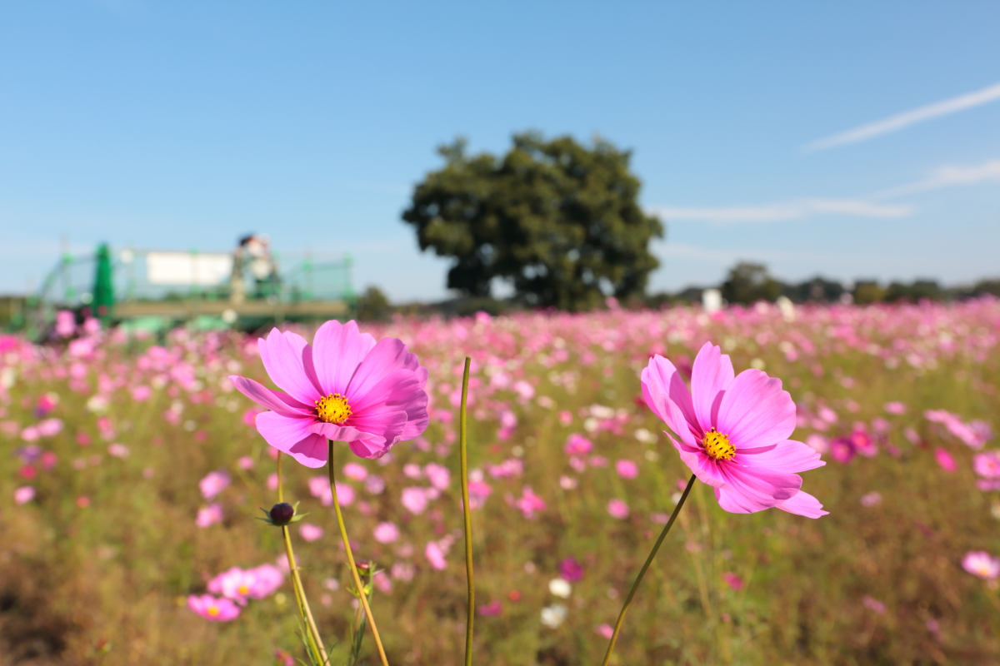
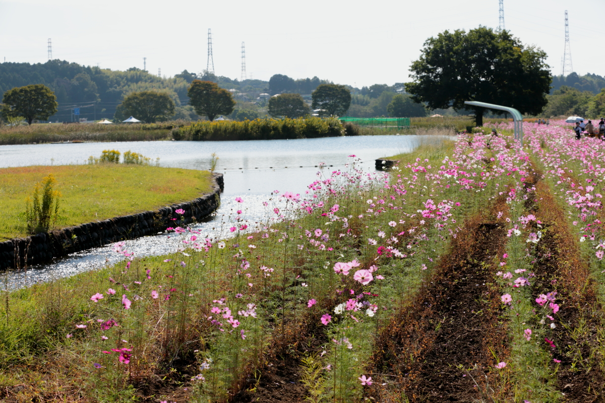

# 2024Oct14_cosmos

<html>
<head>

<meta charset="UTF-8">
<meta http-equiv="Content-Type" content="text/html; charset=UTF-8">
<meta http-equiv="X-UA-Compatible" content="IE=EmulateIE10" />
<meta http-equiv="X-UA-Compatible" content="IE=edge">

<!--ここから上はお決まりの定型文です-->

<!--ここからが表現の書式などを決めるcssという部分-->

<link href="https://cdnjs.cloudflare.com/ajax/libs/lightbox2/2.7.1/css/lightbox.css" rel="stylesheet">

</head>

<body>

モバイル端末をお使いの場合は、画面を横向きにすると
より見やすくご覧頂けます。

<!--ここ上は、ほぼそのまま使います！-->

<!--QRコードの挿入例-->

 アクセス用QRコード

<marquee direction="left" scrollamount="20" width="30%">(^_^)/~hada</marquee>

<!--流れ文字の挿入例-->
<h1><marquee behavior="left">!!! 2024/10/14 、鬼怒川河川敷公園のコスモスが満開です !!!</marquee></h1>

<!--上段にパンクズリストを入れる時の例-->
<!--

<a href="https://torokoid.github.io/Mashiko_himawari_4/" target="_blank">2024年8月10日、益子ひまわり祭</a>><a href="https://torokoid.github.io/20240817_hagurosan/" target="_blank">2024年8月17日、羽黒山</a>><a href="https://torokoid.github.io/20240930_hagurosan/" target="_blank">2024年9月30日、羽黒山</a>><a href="https://torokoid.github.io/20241003_cluster/" target="_blank">10月3日、Cluster Accelerator</a>><a>羽田さんの悠々自適な１カ月を根掘り葉掘りする会@ふくわうち</a>

-->
                          

<!--ここから下が、本体部分-->

<h2>鬼怒川河川敷公園！</h2>

<h2>池の魚は鯉で売店で売られている餌をもらって育ってます。 池の水は鬼怒川本流から地下経路を通って砂で濾過された透明な水！</h2>

<h2>遠くの山々は日光連山。左端が男体山！</h2>

<!--

<h2>集合写真！</h2>

-->

   

   

 <!--
<h2>残暑厳しい中、水泳メンバーが集まりました みんな元気そうです では、又の再会を楽しみにしています！</h2>-->

         

  

      

<!--本体はここまで-->

<!--画面に空白地帯を作って、背景が見えるようにしています-->
                                              

<!-- フッタ -->
<footer>

Copyright 2024/10/14 S.Hada

</footer>

<!--HPにさまざまなJavaScriptを呼び込むための書式-->

